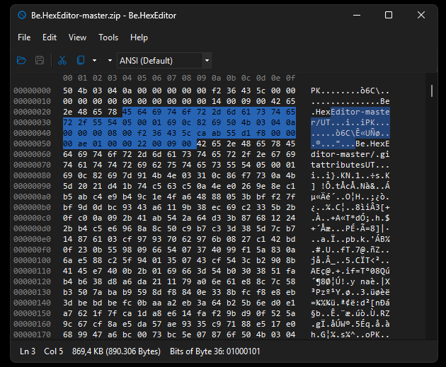

# HexBox

Be.HexEditor is a lightweight and efficient hexadecimal editor for Windows, designed for inspecting and editing binary files with ease. It contains a reuseable HexBox control for Windows Forms.

- Documentation: [Docs Home](docs/index.md)

## 📸 Screenshot



## 🚀 Features

- View and edit files in hexadecimal and ASCII
- Fast performance even with large files
- Simple and intuitive user interface
- Search and replace (hex and text)
- File comparison support
- Read-only and editable modes
- Supports standard Windows file operations

## 🧰 Use Cases

- Inspect binary files
- Debug file formats
- Reverse engineering
- Modify executables or data files
- Analyze memory dumps

## 🖥️ Requirements

- Windows OS
- No additional dependencies required

## 📦 Installation

1. Download the latest release
2. Extract the archive
3. Run the executable (`Be.HexEditor.exe`)

No installation required.

## 🛠️ Development

This repository contains the source code migrated from SourceForge https://sourceforge.net/projects/hexbox/.

### Build

Open the solution in Visual Studio and build:

```powershell
msbuild HexBox.sln
